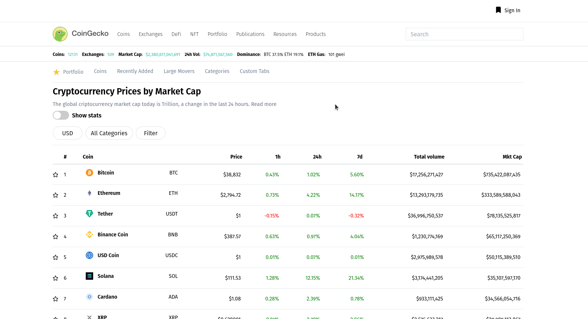

# Coingecko_Clone_TOP
## Alex Srebernic   
This is a mediocre clone of the Coingecko page made it with:    
- the API of Coingecko
- React
- Redux
- Tailwind
- React Router
- Chart.js.    

[LIVE SERVER](https://alexsrebernic.github.io/Coingecko_Clone_TOP/#/)

# Run app locally  
The steps to run this app locally are:
1. Clone,pull or download this repository.
2. Add your Firebase config in this path /src/firebase-config.js and export it default
3. Run in terminal **npm run start**
4. Go to  http://localhost:3000
